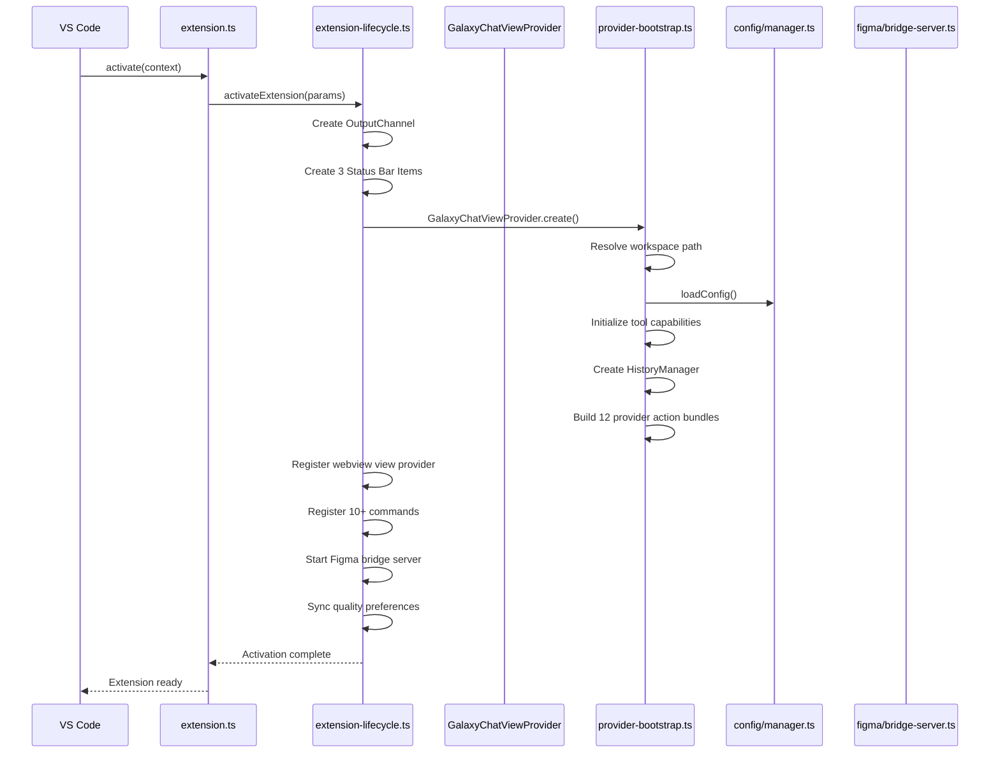
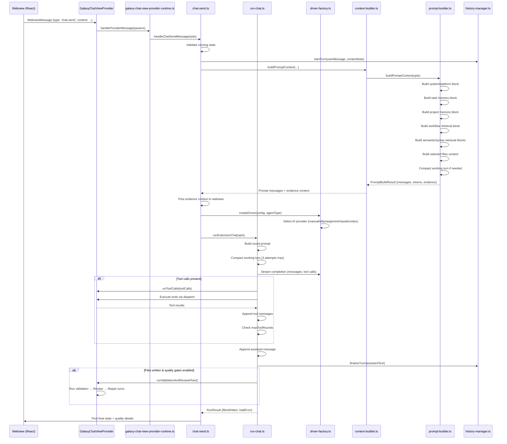
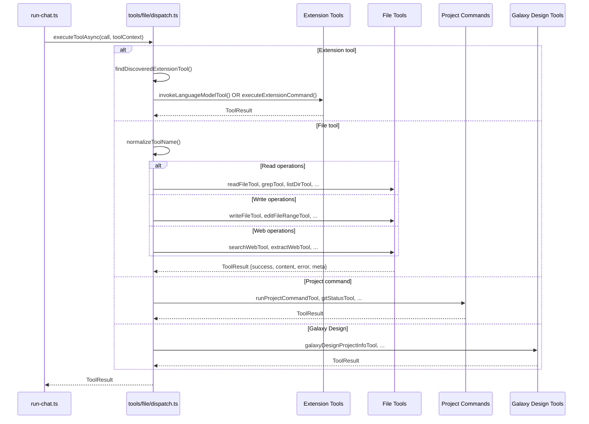
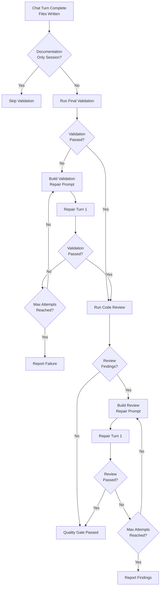
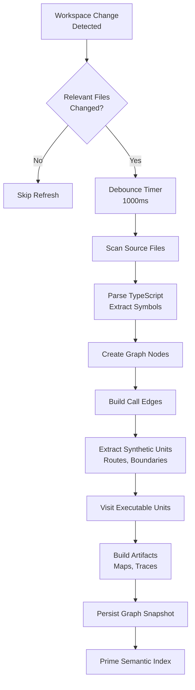
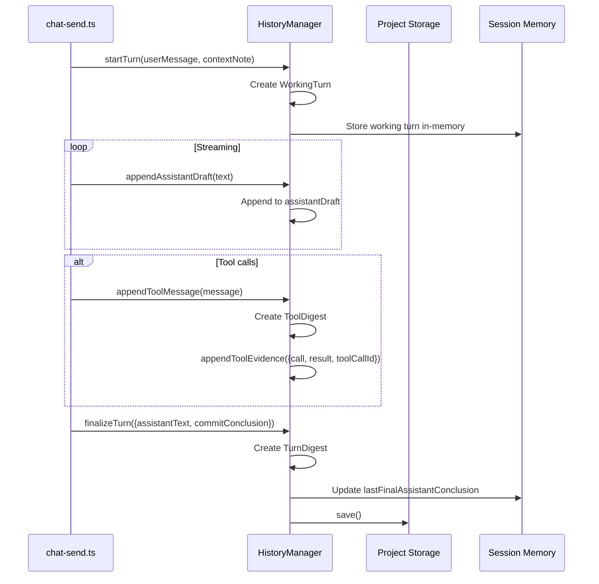
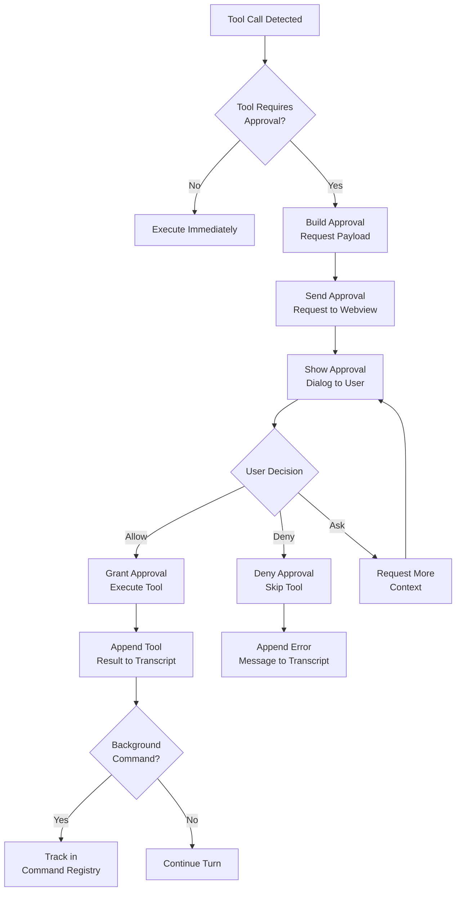
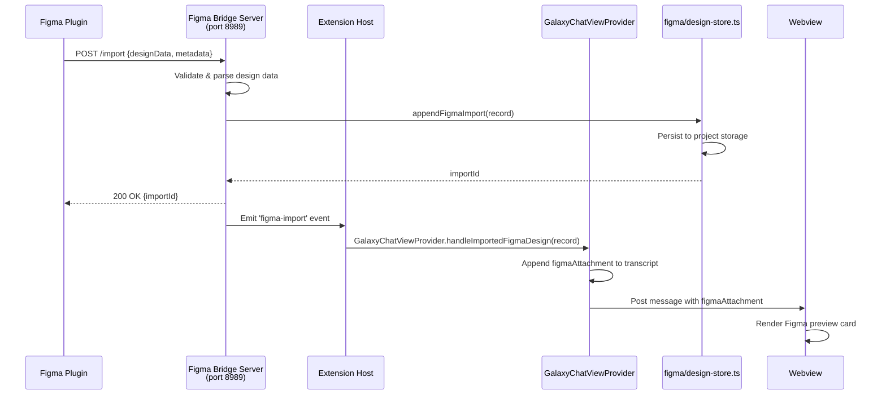
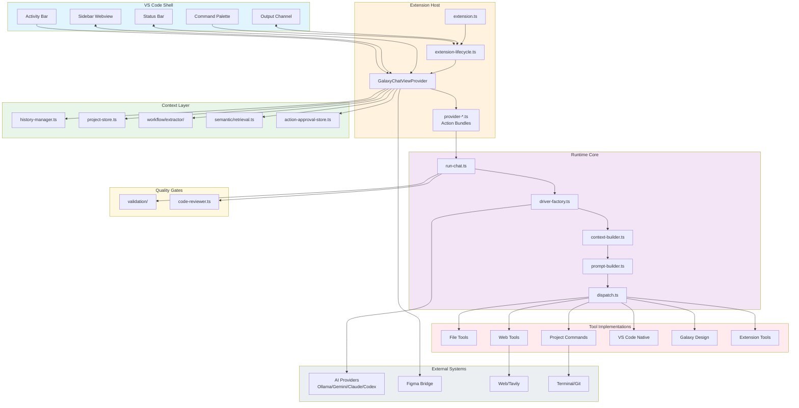

# 🌌 Galaxy VS Code Extension - Workflow Architecture

**Tác giả**: Bùi Trọng Hiếu (Kevin Bui)  
**Version**: 0.1.55  
**Cập nhật**: 2026-04-01

---

## 📋 Mục lục

1. [Tổng quan kiến trúc](#1-tổng-quan-kiến-trúc)
2. [Luồng kích hoạt extension](#2-luồng-kích-activation)
3. [Luồng xử lý chat message](#3-luồng-xử-lý-chat-message)
4. [Luồng thực thi tools](#4-luồng-thực-thi-tools)
5. [Luồng quality gates](#5-luồng-quality-gates)
6. [Luồng workflow graph retrieval](#6-luồng-workflow-graph-retrieval)
7. [Luồng quản lý session & history](#7-luồng-quản-lý-session--history)
8. [Luồng approval workflow](#8-luồng-approval-workflow)
9. [Luồng Figma bridge](#9-luồng-figma-bridge)
10. [Sơ đồ tổng hợp](#10-sơ-đồ-tổng-hợp)

---

## 1. Tổng quan kiến trúc

### 1.1 Kiến trúc tổng thể

```
┌─────────────────────────────────────────────────────────────────┐
│                    VS Code Shell (Native)                       │
├─────────────────────────────────────────────────────────────────┤
│  Activity Bar  │  Sidebar Container  │  Status Bar  │  Output  │
│  (Galaxy Icon) │  (Webview - React)  │  (3 items)   │  Channel │
└────────────────┴─────────────────────┴──────────────┴──────────┘
                         │
                         ▼
┌─────────────────────────────────────────────────────────────────┐
│                  Extension Host (TypeScript)                    │
├─────────────────────────────────────────────────────────────────┤
│  extension.ts → extension-lifecycle.ts → galaxy-chat-view-      │
│  provider.ts → provider-*.ts (action bundles)                   │
└─────────────────────────────────────────────────────────────────┘
                         │
                         ▼
┌─────────────────────────────────────────────────────────────────┐
│                    Runtime Core                                 │
├─────────────────────────────────────────────────────────────────┤
│  run-chat.ts → driver-factory.ts → context-builder.ts →         │
│  prompt-builder.ts → dispatch.ts → tools/                       │
└─────────────────────────────────────────────────────────────────┘
                         │
                         ▼
┌─────────────────────────────────────────────────────────────────┐
│                    Context Layer                                │
├─────────────────────────────────────────────────────────────────┤
│  history-manager.ts │ project-store.ts │ workflow/ │ semantic/  │
│  telemetry.ts       │ action-approval-store.ts │ syntax/       │
└─────────────────────────────────────────────────────────────────┘
```

### 1.2 Các thành phần chính

| Component | File chính | Mô tả |
|-----------|------------|-------|
| **Entry Point** | `extension.ts` | Activate/deactivate extension |
| **Lifecycle** | `extension-lifecycle.ts` | Register commands, status items, webview provider |
| **Provider** | `galaxy-chat-view-provider.ts` | Main sidebar provider, orchestration shell |
| **Bootstrap** | `provider-bootstrap.ts` | Initialize provider state and action bundles |
| **Runtime** | `chat-runtime.ts` | Multi-agent orchestration, repair turns |
| **Chat** | `run-chat.ts` | One full chat turn execution |
| **Tools** | `tools/file/dispatch.ts` | Async tool dispatch (40+ tools) |
| **Quality** | `quality-gates.ts` | Validation & review pipeline |
| **Workflow** | `context/workflow/extractor/runtime.ts` | Graph extraction & retrieval |
| **History** | `context/entities/history-manager.ts` | Session & turn management |

---

## 2. Luồng kích hoạt (Activation Flow)

### 2.1 Sequence Diagram



### 2.2 Chi tiết các bước

#### Bước 1: Entry Point (`extension.ts`)
```typescript
export function activate(context: vscode.ExtensionContext): void {
  activateHostedExtension({
    context,
    viewType: GalaxyChatViewProvider.viewType,
    createSidebarProvider: (chrome) => GalaxyChatViewProvider.create(context, chrome),
    clearCurrent: () => GalaxyChatViewProvider.clearCurrent(),
    handleImportedFigmaDesign: (record) => GalaxyChatViewProvider.handleImportedFigmaDesign(record),
  });
}
```

#### Bước 2: Lifecycle Setup (`extension-lifecycle.ts:41-150`)
- Tạo `OutputChannel` cho logs
- Tạo 3 status bar items:
  - **Run Status** (priority 103): Hiển thị trạng thái thực thi
  - **Agent** (priority 102): Hiển thị agent hiện tại, click để switch
  - **Approval** (priority 101): Hiển thị chế độ approval
- Register webview view provider với `retainContextWhenHidden: true`
- Register commands:
  - `galaxy-code.openChat`, `galaxy-code.openChatRight`
  - `galaxy-code.clearHistory`, `galaxy-code.openConfig`
  - `galaxy-code.switchAgent`, `galaxy-code.openLogs`
  - `galaxy-code.openTelemetrySummary`
  - Toggle review/validation commands
- Start Figma bridge server (port 8989)

#### Bước 3: Provider Bootstrap (`provider-bootstrap.ts:103-250`)
```typescript
export function initializeGalaxyChatViewProvider(
  provider: GalaxyChatViewProviderBootstrapTarget,
  context: vscode.ExtensionContext,
  chrome: GalaxyWorkbenchChrome,
): void {
  // 1. Resolve workspace path & project storage
  provider.workspacePath = resolveHostedStorageWorkspacePath();
  provider.projectStorage = getProjectStorageInfo(provider.workspacePath);
  
  // 2. Load config & compute tool capabilities
  const config = loadConfig();
  provider.toolCapabilities = getWorkspaceToolCapabilities(config, projectMeta);
  provider.toolToggles = getWorkspaceToolToggles(config, projectMeta);
  
  // 3. Create HistoryManager
  provider.historyManager = createHistoryManager({
    workspacePath: provider.workspacePath,
    notes: loadNotes(),
  });
  
  // 4. Build 12 provider action bundles
  provider.qualityActions = buildProviderQualityActions({...});
  provider.messageActions = buildProviderMessageActions({...});
  provider.workbenchActions = buildProviderWorkbenchActions({...});
  provider.utilityActions = buildProviderUtilityActions({...});
  provider.workspaceToolActions = buildProviderWorkspaceToolActions({...});
  provider.reviewActions = buildProviderReviewActions({...});
  provider.commandActions = buildProviderCommandActions({...});
  provider.runtimeActions = buildProviderRuntimeActions({...});
  provider.sessionActions = buildProviderSessionActions({...});
  provider.workspaceSyncActions = buildProviderWorkspaceSyncActions({...});
  provider.viewActions = buildProviderViewActions({...});
  provider.webviewActionCallbacks = createProviderWebviewActionCallbacks({...});
  provider.chatRuntimeCallbacks = buildProviderChatRuntimeCallbacks({...});
}
```

---

## 3. Luồng xử lý chat message

### 3.1 Sequence Diagram



### 3.2 Chi tiết các giai đoạn

#### Giai đoạn 1: Message Reception (`chat-send.ts:50-150`)
```typescript
export async function handleChatSendMessage(opts: {
  workspacePath: string;
  message: WebviewMessage;
  isRunning: boolean;
  selectedAgent: AgentType;
  qualityPreferences: QualityPreferences;
  toolCapabilities: ToolCapabilities;
  // ... callbacks
}): Promise<void> {
  // 1. Validate running state
  if (opts.isRunning) {
    opts.showWorkbenchError('Galaxy is already running...');
    return;
  }
  
  // 2. Build user message
  const userMessage: ChatMessage = {
    id: createMessageId(),
    role: 'user',
    content: opts.message.content,
    timestamp: Date.now(),
    attachments: opts.message.attachments,
    images: opts.message.images,
    figmaAttachments: opts.message.figmaAttachments,
  };
  
  // 3. Start turn in history manager
  opts.historyManager.startTurn(userMessage, opts.message.contextNote);
  
  // 4. Build prompt context
  const promptBuild = await buildPromptContext({
    agentType: opts.selectedAgent,
    notes: opts.historyManager.getNotes(),
    sessionMemory: opts.historyManager.getSessionMemory(),
    workingTurn: opts.historyManager.getWorkingTurn(),
  });
  
  // 5. Post evidence context to webview
  await opts.onEvidenceContext?.({
    content: promptBuild.evidenceContent,
    tokens: promptBuild.evidenceTokens,
    entryCount: promptBuild.evidenceEntryCount,
    finalPromptTokens: promptBuild.finalPromptTokens,
    focusSymbols: promptBuild.focusSymbols,
    manualPlanningContent: promptBuild.manualPlanningContent,
    manualReadBatchItems: promptBuild.manualReadBatchItems,
    readPlanProgressItems: promptBuild.readPlanProgressItems,
    confirmedReadCount: promptBuild.confirmedReadCount,
  });
}
```

#### Giai đoạn 2: Prompt Building (`prompt-builder.ts:60-200`)
```typescript
export async function buildPromptContext(opts: {
  agentType: AgentType;
  notes: string;
  sessionMemory: SessionMemory;
  workingTurn: WorkingTurn | null;
}): Promise<PromptBuildResult> {
  const messages: ChatMessage[] = [];
  
  // 1. Extract paths from user message
  const mentionedPaths = extractMentionedPaths(opts.workingTurn?.userMessage.content ?? '');
  const workingTurnFiles = opts.workingTurn?.toolDigests.flatMap(d => [
    ...d.filesRead, ...d.filesWritten, ...d.filesReverted
  ]) ?? [];
  
  // 2. Build retrieval seed paths
  const activeTaskRetrievalPaths = uniquePaths([
    ...opts.sessionMemory.activeTaskMemory.filesTouched,
    ...opts.sessionMemory.activeTaskMemory.keyFiles,
  ]);
  const projectHintPaths = selectProjectHintPaths(queryText, ...);
  const sqliteHintPaths = queryRagHintPaths(workspacePath, queryText, 4);
  const workflowRetrievalBlock = await buildWorkflowRetrievalBlock({...});
  
  // 3. Build context blocks
  const notesContent = opts.notes.trim() ? `[NOTES]\n${opts.notes.trim()}` : '';
  const systemPlatformContent = buildSystemPlatformContent();
  const taskMemoryContent = buildTaskMemoryContent(taskMemory);
  const projectMemoryContent = buildProjectMemoryContent(opts.sessionMemory.projectMemory);
  const activeTaskMemoryContent = buildActiveTaskMemoryContent(opts.sessionMemory.activeTaskMemory);
  const syntaxIndexBlock = await buildSyntaxIndexContext({...});
  const semanticRetrievalBlock = await buildSemanticRetrievalContext({...});
  const workflowRereadGuard = {...};
  
  // 4. Compact working turn if needed
  const workingTurnBudget = computeWorkingContextBudget({...});
  const compacted = opts.historyManager.compactWorkingTurn({workingTurnBudget, ...});
  
  return {
    messages,
    finalPromptTokens: estimateTokens(finalPrompt),
    evidenceContent,
    evidenceTokens,
    evidenceEntryCount,
    focusSymbols,
    manualPlanningContent,
    manualReadBatchItems,
    readPlanProgressItems,
    confirmedReadCount,
    workflowRereadGuard,
  };
}
```

#### Giai đoạn 3: Driver Execution (`run-chat.ts:100-250`)
```typescript
export async function runExtensionChat(opts: {
  config: GalaxyConfig;
  agentType: AgentType;
  historyManager: HistoryManager;
  toolContext: FileToolContext;
  onChunk: (chunk: StreamChunk) => Promise<void>;
  onMessage: (message: ChatMessage) => Promise<void>;
  onToolCalls?: (toolCalls: readonly ToolCall[]) => Promise<void>;
  requestToolApproval: (approval: PendingActionApproval) => Promise<ToolApprovalDecision>;
}): Promise<RunResult> {
  const driver = createDriver(opts.config, opts.agentType, true);
  const filesWritten = new Set<string>();
  const maxToolRounds = opts.config.maxToolRounds ?? null;
  
  for (let round = 0; maxToolRounds === null || round < maxToolRounds; round += 1) {
    // 1. Build round prompt with compaction
    let roundPrompt = await buildRoundPrompt();
    for (let attempt = 0; attempt < 3; attempt += 1) {
      const compacted = opts.historyManager.compactWorkingTurn({...});
      if (!compacted) break;
      roundPrompt = await buildRoundPrompt();
    }
    
    // 2. Stream completion from driver
    const result = await driver.streamCompletion({
      messages: roundPrompt.messages,
      onChunk: opts.onChunk,
      onToolCalls: async (toolCalls) => {
        await opts.onToolCalls?.(toolCalls);
        
        // 3. Execute tools
        for (const call of toolCalls) {
          const approvalDecision = await checkApproval(call, opts.requestToolApproval);
          if (approvalDecision === 'deny') continue;
          
          const toolResult = await executeToolAsync(call, opts.toolContext);
          await opts.onMessage(buildToolMessage(call, toolResult));
          
          // Track written files
          if (toolResult.meta?.filePath) {
            filesWritten.add(toolResult.meta.filePath);
          }
        }
      },
    });
    
    // 4. Finalize turn
    if (result.finishReason === 'stop') {
      opts.historyManager.finalizeTurn({
        assistantText: result.content,
        commitConclusion: true,
      });
      break;
    }
  }
  
  return {filesWritten: [...filesWritten], hadError: false};
}
```

---

## 4. Luồng thực thi tools

### 4.1 Tool Categories

| Group | Tools | File definitions |
|-------|-------|------------------|
| **File & Reading** (15) | `read_file`, `write_file`, `edit_file_range`, `grep`, `list_dir`, `head`, `tail`, `read_document`, `find_test_files`, ... | `tools/file/definitions/file-tools.ts` |
| **Web Research** (5) | `search_web`, `extract_web`, `map_web`, `crawl_web`, `read_web_page` | `tools/file/definitions/web-tools.ts` |
| **Terminal & Commands** (8) | `run_terminal_command`, `await_terminal_command`, `kill_terminal_command`, `git_*` | `tools/project-command/index.ts` |
| **VS Code Native** (6) | `vscode_open_diff`, `vscode_show_problems`, `vscode_workspace_search`, `vscode_find_references`, ... | `tools/file/definitions/vscode-native-tools.ts` |
| **Quality & Review** (2) | `validate_code`, `request_code_review` | `tools/file/definitions/quality-tools.ts` |
| **Galaxy Design** (4) | `galaxy_design_project_info`, `galaxy_design_registry`, `galaxy_design_init`, `galaxy_design_add` | `tools/file/definitions/galaxy-design-tools.ts` |
| **Extension Tools** (dynamic) | Discovered from VS Code extensions | `tools/file/definitions/extension-tools.ts` |

### 4.2 Dispatch Flow



### 4.3 Tool Execution Details (`dispatch.ts:150-350`)

```typescript
export async function executeToolAsync(call: ToolCall, toolContext: FileToolContext): Promise<ToolResult> {
  // 1. Check extension tools first
  const extensionTool = findDiscoveredExtensionTool(toolContext.config, call.name);
  if (extensionTool) {
    if (toolContext.config.extensionToolToggles[extensionTool.tool.key] !== true) {
      return {success: false, content: '', error: `Extension tool is disabled`};
    }
    
    if (extensionTool.tool.invocation === 'lm_tool') {
      return toolContext.invokeLanguageModelTool(
        extensionTool.tool.runtimeName,
        extensionTool.tool.title,
        extensionTool.group.extensionId,
        call.params,
      );
    }
    
    return toolContext.executeExtensionCommand(
      extensionTool.tool.commandId,
      extensionTool.tool.title,
      extensionTool.group.extensionId,
    );
  }
  
  // 2. Normalize tool name
  const toolName = normalizeToolName(call.name);
  
  // 3. Dispatch to specific tool implementation
  switch (toolName) {
    case 'read_file':
      return readFileTool(toolContext.workspacePath, p(call, 'path'), {
        maxLines: Number(call.params.maxLines) || undefined,
        offset: Number(call.params.offset) || undefined,
      });
      
    case 'write_file':
      return writeFileTool(toolContext.workspacePath, p(call, 'path'), p(call, 'content'));
      
    case 'edit_file_range':
      return executeEditFileRangeTool(toolContext.workspacePath, {
        path: p(call, 'path'),
        start_line: Number(call.params.start_line),
        end_line: Number(call.params.end_line),
        new_content: p(call, 'new_content'),
        expected_total_lines: Number(call.params.expected_total_lines),
        expected_range_content: p(call, 'expected_range_content'),
      });
      
    case 'run_terminal_command':
      return runProjectCommandTool(toolContext.workspacePath, {
        command: p(call, 'command'),
        cwd: p(call, 'cwd') || undefined,
        background: Boolean(call.params.background),
        label: p(call, 'label') || undefined,
      });
      
    case 'galaxy_design_project_info':
      return galaxyDesignProjectInfoTool(p(call, 'path') || toolContext.workspacePath);
      
    // ... 40+ tool cases
    
    default:
      return {success: false, content: '', error: `Unknown tool: ${toolName}`};
  }
}
```

---

## 5. Luồng Quality Gates

### 5.1 Quality Gate Pipeline



### 5.2 Chi tiết implementation (`quality-gates.ts:100-300`)

```typescript
export async function runProviderValidationAndReviewFlow(
  bindings: ProviderQualityGateBindings,
): Promise<{passed: boolean; repaired: boolean}> {
  const sessionFiles = getSessionFiles(bindings.projectStorage);
  
  // 1. Skip validation for documentation-only sessions
  if (isDocumentationOnlySessionFiles(sessionFiles)) {
    bindings.appendLog('info', 'Documentation-only session, skipping validation.');
    return {passed: true, repaired: false};
  }
  
  let passed = true;
  let repaired = false;
  
  // 2. Run final validation
  if (bindings.qualityPreferences.validateEnabled) {
    bindings.setStatusText('Running final validation...');
    const validationResult = await runFinalValidation({
      workspacePath: bindings.projectStorage.workspacePath,
      sessionFiles: sessionFiles.map(f => f.filePath),
    });
    
    if (!validationResult.passed) {
      passed = false;
      let attempt = 0;
      
      while (!validationResult.passed && attempt < MAX_AUTO_REPAIR_ATTEMPTS) {
        attempt += 1;
        bindings.appendLog('validation', `Validation failed, attempt ${attempt}/${MAX_AUTO_REPAIR_ATTEMPTS}`);
        
        const repairMessage = buildValidationRepairMessage(validationResult, attempt);
        const repairResult = await bindings.runInternalRepairTurn({
          config: bindings.config,
          agentType: bindings.agentType,
          userMessage: repairMessage,
        });
        
        if (repairResult.hadError) break;
        
        validationResult = await runFinalValidation({...});
        repaired = true;
      }
    }
    
    bindings.setQualityDetails(prev => ({
      ...prev,
      validationSummary: formatValidationSummary(validationResult),
    }));
  }
  
  // 3. Run code review
  if (passed && bindings.qualityPreferences.reviewEnabled) {
    bindings.setStatusText('Running code review...');
    const reviewResult = await runCodeReview({
      workspacePath: bindings.projectStorage.workspacePath,
      sessionFiles: sessionFiles.map(f => f.filePath),
    });
    
    const criticalFindings = reviewResult.findings.filter(f => f.severity === 'critical');
    
    if (criticalFindings.length > 0) {
      passed = false;
      let attempt = 0;
      
      while (criticalFindings.length > 0 && attempt < MAX_AUTO_REVIEW_REPAIR_ATTEMPTS) {
        attempt += 1;
        bindings.appendLog('review', `Review found issues, attempt ${attempt}/${MAX_AUTO_REVIEW_REPAIR_ATTEMPTS}`);
        
        const repairMessage = buildReviewRepairMessage(reviewResult, attempt);
        const repairResult = await bindings.runInternalRepairTurn({
          config: bindings.config,
          agentType: bindings.agentType,
          userMessage: repairMessage,
        });
        
        if (repairResult.hadError) break;
        
        const newReview = await runCodeReview({...});
        reviewResult.findings = newReview.findings;
        repaired = true;
      }
    }
    
    bindings.setQualityDetails(prev => ({
      ...prev,
      reviewSummary: formatReviewSummary(reviewResult),
      reviewFindings: reviewResult.findings,
    }));
  }
  
  return {passed, repaired};
}
```

---

## 6. Luồng Workflow Graph Retrieval

### 6.1 Workflow Graph Architecture

```
┌─────────────────────────────────────────────────────────────┐
│                  Workflow Graph System                      │
├─────────────────────────────────────────────────────────────┤
│  extractor/                                                 │
│  ├── runtime.ts        # Build & refresh graph snapshot     │
│  ├── artifacts.ts      # Build maps, trace summaries        │
│  ├── files.ts          # Scan & parse source files          │
│  ├── units.ts          # Parse symbols from TypeScript      │
│  ├── nodes.ts          # Create graph nodes                 │
│  ├── edges.ts          # Create call graph edges            │
│  ├── boundaries.ts     # Extract routes & boundaries        │
│  └── execution.ts      # Visit executable units             │
├─────────────────────────────────────────────────────────────┤
│  query/                  # Semantic query over graph        │
│  reread-guard.ts         # Decide when to reread files      │
│  sync.ts                 # Persist graph to workspace       │
│  artifact-semantic/      # Semantic index for graph maps    │
└─────────────────────────────────────────────────────────────┘
```

### 6.2 Graph Build Flow



### 6.3 Runtime Refresh (`extractor/runtime.ts:80-150`)

```typescript
export async function refreshWorkflowGraph(workspacePath: string): Promise<WorkflowGraphSnapshot> {
  // 1. Build full graph snapshot
  const snapshot = await buildWorkflowGraphSnapshot({workspacePath});
  
  // 2. Persist to workspace storage
  syncWorkflowGraphSnapshot(workspacePath, snapshot);
  
  // 3. Prime semantic index for retrieval
  void primeWorkflowArtifactSemanticIndex(workspacePath);
  
  return snapshot;
}

export async function buildWorkflowGraphSnapshot(opts: {
  workspacePath: string;
}): Promise<WorkflowGraphSnapshot> {
  const projectConfig = loadTypeScriptProjectConfig(opts.workspacePath);
  
  // 1. Scan & parse all source files
  const parsedFiles = scanWorkspaceSourceFiles(opts.workspacePath)
    .map(relPath => parseWorkflowFile(opts.workspacePath, relPath, projectConfig))
    .filter((file): file is ParsedFile => Boolean(file));
  
  const nodes = new Map<string, WorkflowNodeRecord>();
  const edges = new Map<string, WorkflowEdgeRecord>();
  const exportedSymbolsByFile = new Map<string, ReadonlyMap<string, string>>();
  
  // 2. Create nodes from parsed units
  parsedFiles.forEach(parsedFile => {
    parsedFile.units.forEach(unit => {
      addNode(nodes, createGraphNodeFromUnit(unit));
    });
    exportedSymbolsByFile.set(
      parsedFile.relativePath,
      new Map(parsedFile.units
        .filter(unit => unit.exported && unit.symbolName)
        .map(unit => [unit.symbolName!, unit.id] as const)
      ),
    );
  });
  
  // 3. Extract synthetic units (routes, boundaries)
  const syntheticUnits: SymbolUnit[] = [];
  parsedFiles.forEach(parsedFile => {
    syntheticUnits.push(...extractRouteAndBoundarySeeds(
      parsedFile, nodes, edges, exportedSymbolsByFile
    ));
  });
  
  // 4. Visit executable units to build edges
  parsedFiles.forEach(parsedFile => {
    const combinedUnits = [...parsedFile.units, ...syntheticUnitsByFile.get(parsedFile.relativePath) ?? []];
    combinedUnits.forEach(unit => {
      visitExecutableUnit(unit, parsedFile, nodes, edges, exportedSymbolsByFile);
    });
  });
  
  // 5. Build artifacts
  const sortedNodes = Object.freeze([...nodes.values()].sort((a, b) => a.id.localeCompare(b.id)));
  const sortedEdges = Object.freeze([...edges.values()].sort((a, b) => a.id.localeCompare(b.id)));
  const artifacts = buildWorkflowArtifacts({nodes: sortedNodes, edges: sortedEdges});
  
  return Object.freeze({
    nodes: sortedNodes,
    edges: sortedEdges,
    maps: artifacts.maps,
    mapSources: artifacts.mapSources,
    traceSummaries: artifacts.traceSummaries,
  });
}
```

### 6.4 Retrieval in Prompt Building (`prompt-builder.ts:100-150`)

```typescript
export async function buildPromptContext(opts: {...}): Promise<PromptBuildResult> {
  // ... other blocks
  
  // 1. Extract mentioned paths from user message
  const mentionedPaths = extractMentionedPaths(opts.workingTurn?.userMessage.content ?? '');
  
  // 2. Build workflow retrieval block
  const workflowRetrievalBlock = await buildWorkflowRetrievalBlock({
    workspacePath: opts.sessionMemory.workspacePath,
    queryText,
    workingTurnFiles,
    mentionedPaths,
  });
  
  // 3. Compute retrieval seed paths
  const retrievalSeedPaths = uniquePaths([
    ...mentionedPaths,
    ...workingTurnFiles,
    ...takeRecentPaths(activeTaskRetrievalPaths, 6),
    ...projectHintPaths,
    ...sqliteHintPaths,
    ...workflowRetrievalBlock.candidatePaths,
  ]);
  
  // 4. Build workflow reread guard
  const workflowRereadGuard = Object.freeze({
    enabled: shouldEnableWorkflowRereadGuard(
      queryText,
      workflowRetrievalBlock.entryCount,
      workflowRetrievalBlock.candidatePaths,
    ),
    candidatePaths: workflowRetrievalBlock.candidatePaths,
    entryCount: workflowRetrievalBlock.entryCount,
    queryText,
  });
  
  // ... return prompt build result
}
```

---

## 7. Luồng quản lý Session & History

### 7.1 Session Memory Structure

```typescript
interface SessionMemory {
  workspaceId: string;
  workspacePath: string;
  projectMemory: ProjectMemory;
  activeTaskMemory: TaskMemory;
  taskMemoryIndex: TaskMemoryIndex;
  lastFinalAssistantConclusion: string;
  lastUpdateTime: number;
}

interface TaskMemory {
  taskId: string;
  summary: string;
  keyFiles: readonly string[];
  filesTouched: readonly string[];
  lastUpdateTime: number;
}

interface WorkingTurn {
  userMessage: ChatMessage;
  assistantDraft: string;
  toolDigests: readonly ToolDigest[];
  contextNote?: string;
  roundCount: number;
}
```

### 7.2 History Manager Flow



### 7.3 Compaction Logic (`history-manager.ts:150-250`)

```typescript
export function compactWorkingTurn(opts?: {
  force?: boolean;
  workingTurnBudget?: number;
  promptTokensEstimate?: number;
}): boolean {
  if (!this.workingTurn) return false;
  
  const currentTokens = estimateTokens(this.workingTurn.assistantDraft);
  const budget = opts?.workingTurnBudget ?? DEFAULT_WORKING_TURN_BUDGET;
  
  if (!opts?.force && currentTokens <= budget) {
    return false;
  }
  
  // 1. Keep first and last tool digests
  const preservedDigests = [
    this.workingTurn.toolDigests[0],
    this.workingTurn.toolDigests[this.workingTurn.toolDigests.length - 1],
  ].filter(Boolean);
  
  // 2. Truncate assistant draft
  const truncatedDraft = truncateToTokenBudget(
    this.workingTurn.assistantDraft,
    budget,
  );
  
  this.workingTurn = {
    ...this.workingTurn,
    assistantDraft: truncatedDraft,
    toolDigests: preservedDigests,
    compacted: true,
  };
  
  return true;
}
```

---

## 8. Luồng Approval Workflow

### 8.1 Approval Flow Diagram



### 8.2 Approval Implementation (`chat-approvals.ts`)

```typescript
export async function checkApproval(
  call: ToolCall,
  requestApproval: (approval: PendingActionApproval) => Promise<ToolApprovalDecision>,
): Promise<ToolApprovalDecision> {
  const blockedCapability = getBlockedCapability(call.name);
  
  if (!blockedCapability) {
    return 'allow';
  }
  
  const approvalRequest = buildApprovalRequest(call, blockedCapability);
  const decision = await requestApproval(approvalRequest);
  
  if (decision === 'allow') {
    grantActionApproval(call.id);
  } else if (decision === 'deny') {
    denyActionApproval(call.id);
  }
  
  return decision;
}

export function getBlockedCapability(toolName: string): CapabilityKey | null {
  const toolToCapability: Record<string, CapabilityKey> = {
    'write_file': 'editFiles',
    'edit_file_range': 'editFiles',
    'insert_file_at_line': 'editFiles',
    'multi_edit_file_ranges': 'editFiles',
    'run_terminal_command': 'runCommands',
    'run_project_command': 'runCommands',
    'search_web': 'webResearch',
    'crawl_web': 'webResearch',
  };
  
  return toolToCapability[toolName] ?? null;
}
```

---

## 9. Luồng Figma Bridge

### 9.1 Figma Integration Flow



### 9.2 Bridge Server Setup (`extension-lifecycle.ts:150-200`)

```typescript
export async function ensureFigmaBridgeStarted(
  handleImportedFigmaDesign: HandleImportedFigmaDesign,
  showFeedback: boolean,
): Promise<void> {
  if (figmaBridge) {
    return;
  }
  
  figmaBridge = await startFigmaBridgeServer({
    port: FIGMA_BRIDGE_PORT,
    host: FIGMA_BRIDGE_HOST,
    onImport: async (record) => {
      const handled = handleImportedFigmaDesign(record);
      if (!handled) {
        console.warn('[galaxy] Figma import not handled, sidebar not ready.');
      }
    },
  });
  
  if (showFeedback) {
    vscode.window.showInformationMessage(
      `Galaxy Code Figma bridge started on port ${FIGMA_BRIDGE_PORT}`
    );
  }
}
```

---

## 10. Sơ đồ tổng hợp

### 10.1 Full System Flow



### 10.2 Data Flow Summary

| Stage | Input | Output | Key Files |
|-------|-------|--------|-----------|
| **Activation** | VS Code context | Provider instance, commands, status items | `extension.ts`, `extension-lifecycle.ts`, `provider-bootstrap.ts` |
| **Message Reception** | WebviewMessage | User ChatMessage, WorkingTurn | `chat-send.ts`, `history-manager.ts` |
| **Prompt Building** | SessionMemory, WorkingTurn | Prompt messages, evidence context, token estimates | `prompt-builder.ts`, `context-builder.ts` |
| **Driver Execution** | Prompt messages | Stream chunks, tool calls, final content | `run-chat.ts`, `driver-factory.ts` |
| **Tool Dispatch** | ToolCall[] | ToolResult[] | `dispatch.ts`, `tools/*/index.ts` |
| **Quality Gates** | Files written | Validation summary, review findings | `quality-gates.ts`, `code-reviewer.ts`, `validation/` |
| **Workflow Graph** | Source file changes | Graph snapshot, maps, traces | `workflow/extractor/runtime.ts`, `sync.ts` |
| **Session Persistence** | Turn digest | Saved session memory | `history-manager.ts`, `project-store.ts` |

---

## 📎 Phụ lục

### A. Tool Capability Matrix

| Capability | Tools | Approval Required |
|------------|-------|-------------------|
| `readProject` | `read_file`, `grep`, `list_dir`, `head`, `tail`, `read_document` | ❌ No |
| `editFiles` | `write_file`, `edit_file_range`, `insert_file_at_line`, `multi_edit_file_ranges` | ✅ Yes |
| `runCommands` | `run_terminal_command`, `run_project_command`, `git_*` | ✅ Yes |
| `webResearch` | `search_web`, `extract_web`, `map_web`, `crawl_web` | ✅ Yes |
| `validation` | `validate_code` | ❌ No |
| `review` | `request_code_review` | ❌ No |
| `vscodeNative` | `vscode_open_diff`, `vscode_show_problems`, ... | ❌ No |
| `galaxyDesign` | `galaxy_design_*` | ⚠️ Init/Add require approval |

### B. Agent Types

| Agent | Provider | Use Case |
|-------|----------|----------|
| `manual` | User-driven | Testing, debugging |
| `ollama` | Local Ollama | Privacy-first, offline |
| `gemini` | Google Gemini | Fast, cost-effective |
| `claude` | Anthropic Claude | High-quality reasoning |
| `codex` | OpenAI Codex | Code-specialized |

### C. Key Configuration Options

```jsonc
{
  "galaxy-code.toolCapabilities": {
    "readProject": true,
    "editFiles": true,
    "runCommands": true,
    "webResearch": false,
    "validation": true,
    "review": true,
    "vscodeNative": true,
    "galaxyDesign": true
  },
  "galaxy-code.toolToggles": {
    "read_file": true,
    "write_file": true,
    "edit_file_range": true,
    "run_terminal_command": true,
    // ... per-tool toggles
  },
  "galaxy-code.qualityPreferences": {
    "reviewEnabled": true,
    "validateEnabled": true,
    "fullAccessEnabled": false
  },
  "galaxy-code.maxToolRounds": 5,
  "galaxy-code.maxEmptyContinueAttempts": 3
}
```

---

**Tài liệu này được tạo tự động từ mã nguồn galaxy-vscode-extension version 0.1.55.**
